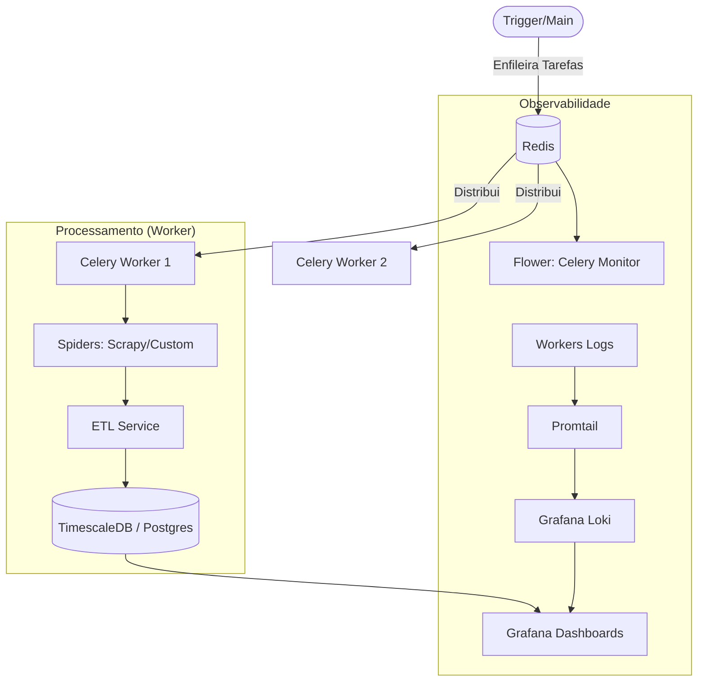

# 📈 Distributed Stock Market Crawler & ETL Pipeline

> **⚠️ AVISO LEGAL**: Este projeto foi desenvolvido estritamente para fins **educacionais e de estudo de arquitetura**. O uso de crawlers para extração de dados deve respeitar os Termos de Uso (ToS) e o arquivo `robots.txt` dos sites alvo (B3, StatusInvest, Fundamentus, etc.). O autor não se responsabiliza pelo uso indevido desta ferramenta.

Este repositório demonstra a implementação de um pipeline de engenharia de dados robusto, distribuído e observável para coleta e processamento de indicadores fundamentalistas do mercado financeiro brasileiro.

---

## 🏗️ Arquitetura do Sistema

O projeto utiliza uma arquitetura baseada em microserviços e processamento assíncrono para garantir escalabilidade e resiliência:



### Principais Componentes:
- **Python & Celery**: Orquestração de tarefas distribuídas e assíncronas.
- **Scrapy Spiders**: Extração otimizada de dados de múltiplas fontes.
- **TimescaleDB (PostgreSQL)**: Armazenamento de dados relacionais e séries temporais.
- **Redis**: Message Broker para comunicação entre o trigger e os workers.
- **Grafana Stack (Loki/Promtail)**: Observabilidade centralizada para logs e métricas.
- **Flower**: Monitoramento em tempo real do estado dos workers e filas.

---

## 🚀 Como Executar

O projeto é totalmente conteinerizado com Docker, facilitando o setup do ambiente completo de engenharia.

### Pré-requisitos
- Docker & Docker Compose
- Python 3.12+ (opcional para desenvolvimento local)

### Instalação e Execução
1. Clone o repositório.
2. Configure o ambiente (opcional, já existem valores padrão):
   ```bash
   cp .env.example .env
   ```
3. Suba o cluster:
   ```bash
   docker-compose up -d
   ```

4. **Trigger da Coleta**:
   Para iniciar uma rodada de coleta, você pode executar o script principal dentro do container do worker:
   ```bash
   docker exec -it stock_market_crawler_worker python main.py
   ```

---

## ☁️ Cloud Deployment (Zero Cost & HA)

Esta aplicação está preparada para deploy em arquitetura serverless de baixo/zero custo:

### Componentes Cloud:
- **Banco de Dados**: [Supabase](https://supabase.com/) (PostgreSQL).
- **Broker (Redis)**: [Upstash](https://upstash.com/) (Serverless Redis).
- **Compute (Worker)**: [Fly.io](https://fly.io/) (Celery Worker).
- **Orquestração**: GitHub Actions (Gatilho diário via `daily-sync.yml`).

### Como Implantar:
1. **Supabase**: Crie um projeto e obtenha a `DATABASE_URL`.
2. **Upstash**: Crie uma instância Redis e obtenha a `CELERY_BROKER_URL`.
3. **GitHub Secrets**: Adicione as URLs acima como secrets no seu repositório GitHub.
4. **Fly.io**: 
   - Instale o `flyctl`.
   - Execute `fly launch` (use o `fly.toml` existente).
   - Configure os segredos no Fly: `fly secrets set DATABASE_URL=... CELERY_BROKER_URL=...`.
5. **Migrações**: Execute as migrações iniciais no Supabase:
   ```bash
   export DATABASE_URL="sua_url_do_supabase"
   uv run alembic upgrade head
   ```

---

## 📊 Monitoramento e Observabilidade

Após subir o ambiente, você pode acessar as seguintes interfaces:

- **Grafana Dashboards**: [http://localhost:3001](http://localhost:3001) (Admin/admin)
  - Visualização dos dados coletados e logs centralizados via Loki.
- **Flower (Celery Monitor)**: [http://localhost:5555](http://localhost:5555)
  - Monitoramento de tarefas em execução, falhas e performance dos workers.
- **Database (Postgres)**: `localhost:5433`

---

## 🛠️ Engenharia de Dados Aplicada
Este projeto demonstra conhecimentos em:
- **Web Scraping Avançado**: Rotação de headers, tratamento de rate limits e parsing complexo.
- **Processamento Assíncrono**: Uso de filas para gerenciar grandes volumes de requisições sem sobrecarregar as fontes.
- **ETL (Extract, Transform, Load)**: Limpeza, normalização e validação de dados financeiros antes da persistência.
- **Infraestrutura como Código (IaC)**: Dockerização completa de múltiplos serviços interdependentes.
- **Observabilidade**: Implementação de logs estruturados e monitoramento de performance.

---

## 📄 Licença
Distribuído sob a licença MIT. Veja `LICENSE` para mais informações.
